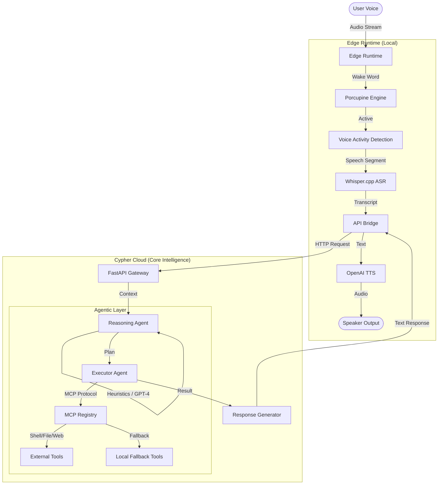

# Project Cypher

An advanced, hybrid AI Operating System designed to bridge the gap between local edge processing and high-level cloud reasoning. Project Cypher functions as an intelligent assistant capable of executing complex real-world tasks through a robust agentic architecture and Model Context Protocol (MCP) integration.

## 🏗️ Architecture

Project Cypher employs a split **Edge-Cloud** architecture to ensure low latency, privacy, and powerful reasoning capabilities.



### Core Components

1.  **Edge Runtime**:
    *   Handles "Hotword" detection locally using **Porcupine** to minimize latency and cloud costs.
    *   Processes speech-to-text using an optimized **Whisper.cpp** integration.
    *   Manages the audio input/output loop.

2.  **Cypher Cloud (The Brain)**:
    *   **Reasoning Agent**: The decision-making cortex. It analyzes user intent, conversation history, and memory to decide whether to simply chat, ask for clarification, or execute tools. It employs smart heuristics to bypass LLMs for imperative commands (e.g., "Open Calculator") for instant execution.
    *   **Executor Agent**: A graph-based execution engine that orchestrates tools. It is built with a robust fallback mechanism—handling **Model Context Protocol (MCP)** tools primarily, but seamlessly falling back to local Python implementations if remote MCP servers are unavailable.

## 🛠️ Tech Stack

*   **Core Language**: Python 3.10+
*   **Backend Framework**: FastAPI (High-performance async API)
*   **Asynchronous Runtime**: `asyncio` (Windows Proactor support)
*   **Edge AI**:
    *   **Wake Word**: Porcupine
    *   **ASR**: Whisper.cpp (Local inference)
*   **Cloud AI / LLM**:
    *   **Reasoning**: OpenAI (GPT-4o / GPT-4 Turbo)
    *   **TTS**: OpenAI Realtime / TTS API
*   **Protocols**:
    *   **MCP**: Model Context Protocol (for standardizing tool interfaces)
    *   **REST**: API Communication
*   **Data & Memory**:
    *   SQLite (Local structured storage)
    *   JSON-based Trace Logs

## 🧠 Models Used

*   **Wake Word Model**: Custom/Standard Porcupine keyword files.
*   **Speech-to-Text**: `whisper-base` or `whisper-small` running via `whisper.cpp` for real-time local transcription.
*   **LLM (Reasoning)**: OpenAI `gpt-4o` (configurable) is used for the complex reasoning layer to parse intent and generate execution plans.
*   **TTS Model**: OpenAI `tts-1` or `tts-1-hd` for natural-sounding voice synthesis.

## 🚀 Installation & Setup

### Prerequisites
*   Python 3.10 or higher.
*   A Windows environment (optimized for PowerShell automation).
*   OpenAI API Key.

### Steps

1.  **Clone the Repository**
    ```bash
    git clone https://github.com/Start-to-code/Project-Cypher.git
    cd cypher_edge_runtime
    ```

2.  **Install Dependencies**
    ```bash
    pip install -r requirements.txt
    # Also install cloud-specific requirements
    pip install -r cypher_cloud/requirements.txt
    ```

3.  **Environment Configuration**
    Create a `.env` file in the root directory:
    ```ini
    OPENAI_API_KEY=sk-proj-...
    PORCUPINE_ACCESS_KEY=...
    # Add other necessary keys
    ```

4.  **Run the Cloud Core**
    ```bash
    cd cypher_cloud
    uvicorn main:app --reload --port 8000
    ```

5.  **Start the Edge Runtime**
    (In a separate terminal)
    ```powershell
    # Execute the edge automation script (if available) or run the client entry point
    python main.py
    ```

## 📖 Objectives

*   **Seamless Integration**: To create an assistant that lives on your OS but thinks in the cloud, allowing for seamless control of local files and applications.
*   **Privacy-First Wake**: Ensure audio is not streamed until the user explicitly activates the assistant.
*   **Latency Minimization**: Use local ASR and heuristic shortcuts to make simple commands feel instantaneous.
*   **Robust Tooling**: Leverage MCP to standardize how the AI interacts with the world (Web, Database, Shell).

## 💡 Tech Talk: The "Real-World" Challenge

Building a truly useful assistant requires more than just connecting to an LLM. Project Cypher addresses specific engineering challenges:
*   **Imperative vs. Conversational**: The `ReasoningAgent` distinguishes between "What's the weather?" (Tool) and "Tell me a joke" (Chat) and "Open Notepad" (Imperative).
*   **The MCP Bypass**: Windows `asyncio` interacts poorly with some subprocess management required by remote MCPs. We engineered a custom bridge to ensure generic MCP clients (like SQLite or Claude) work reliably on Windows.
*   **Heuristic Fallbacks**: LLMs can be slow. We implemented deterministic regex and logic heuristics to execute common commands instantly, bypassing the network roundtrip to OpenAI for trivial tasks.

## 🔮 Future Enhancements

*   **Multi-modal Vision**: Integration of vision capabilities to "see" the user's screen or webcam feed for context.
*   **Local LLM Fallback**: Implementing a small local model (e.g., Llama 3 8B) for offline reasoning when the internet is down.
*   **Long-term Memory Vector Store**: Moving beyond simple JSON history to a vector-based semantic memory (ChromaDB/Pinecone).
*   **Self-Correction Loops**: Agents that can "lint" their own code or retry failed tool executions automatically.

## ✍️ Author

**Avinash Karri**
*Innovative Architect & Developer behind Project Cypher.*
