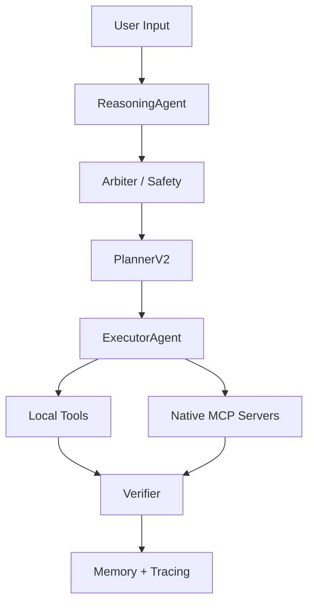

# Project Cypher 🧠⚙️

### An AI Operating System for Real-World Execution, Automation, and Intelligence

**Project Cypher** is a production-oriented **AI Operating System (AI-OS)** that bridges natural language, reasoning, and real-world execution across local systems, cloud services, browsers, CI/CD, and external AI models.

Unlike traditional chatbots, Cypher is designed as an **execution-first**, introspectable, multi-agent system with strong guarantees around safety, traceability, and extensibility.

---

## 🔥 Core Philosophy

**`Intent` → `Reasoning` → `Planning` → `Execution` → `Verification` → `Memory`**

Cypher is not a single agent. It is a **coordinated AI system** with explicit control over:
* **What** should be done
* **Why** it should be done
* **How** it is executed
* **Whether** it succeeded

---

## 🚀 Features & Status

### ✅ Phase 0 — Edge Foundations
*Low-level audio and signal processing pipeline.*
- [x] Wake-word detection
- [x] Voice Activity Detection (VAD)
- [x] Audio normalization & trimming
- [x] Offline ASR support (Whisper.cpp compatible)
- [x] Modular edge runtime

### ✅ Phase 1 — Core Intelligence Loop
*Natural language understanding and system orchestration.*
- [x] Reasoning agent (LLM-based + heuristic fallback)
- [x] Deterministic mode selection (`chat_only`, `auto_tools`, `force_tools`, `clarify_only`)
- [x] Safety-aware decision gating
- [x] Execution context propagation

### ✅ Phase 2 — Planning & Execution Engine
*From intent to real actions.*
- [x] PlannerV2 (deterministic, hardened)
- [x] Multi-step execution plans
- [x] Local tool execution (OS, web, utilities)
- [x] Executor with strict failure semantics
- [x] Automatic fallback from MCP → local tools
- [x] Structured execution results

### ✅ Phase 3 — Memory, Tracing & Observability
*Full introspection into system behavior.*
- [x] Episodic memory (per device / session)
- [x] Trace IDs for every request
- [x] Execution graphs with node status
- [x] Failure maps & slow-node detection
- [x] Debug endpoints for plans, memory, traces

### ✅ Phase 4 — MCP Integration (Native)
*Enterprise-grade extensibility via native MCP servers.*
- [x] Native MCP client registry
- [x] Multiple MCP backends supported: Shell, Docker, GitHub, Playwright (browser automation), Claude / LLM MCP
- [x] Runtime MCP availability probing
- [x] Unified metrics for MCP calls

> **⚠️ Note:** MCP is implemented using **native MCP servers**, not Docker-wrapped MCP.

### 🎙️ Voice System Status
* **Status:** Temporarily Disabled / Hooks Only
* **Details:** Voice pipeline (wake, VAD, ASR, TTS hooks) is implemented but **NOT** wired into the current dev workflow.
* **Strategy:** Development is currently text-first. Voice will be re-enabled in a future phase once core automation stabilizes.

---

## 🧩 System Architecture



### 🛠️ Tech Stack

| Component | Technologies |
| --- | --- |
| **Backend** | Python 3.10+, FastAPI, AsyncIO |
| **AI / LLM** | OpenAI (optional), Anthropic Claude (via Native MCP), Deterministic Fallbacks |
| **Automation** | Native MCP Servers, OS Automation, Playwright MCP, GitHub CI |
| **Observability** | Custom Tracer, Execution Graphs, Metrics & Diagnostics APIs |

---

## 📁 Project Structure

```text
cloud/
└── api/
    ├── assistant/
    │   ├── agents_dir/
    │   │   ├── reasoning_agent.py
    │   │   ├── planner_agent_v2.py
    │   │   ├── executor_agent.py
    │   │   └── brain.py
    │   ├── orchestrator/
    │   │   ├── cypher_graph.py
    │   │   ├── tracer.py
    │   │   └── node.py
    │   ├── mcp/
    │   │   ├── registry.py
    │   │   ├── mcp_client_base.py
    │   │   └── errors.py
    │   ├── tools_registry.py
    │   ├── tools_base.py
    │   └── router.py

```

---

## ▶️ Getting Started

### 1️⃣ Prerequisites

* **Python:** 3.10+
* **Virtual Environment:** Recommended
* **API Keys (Optional):** `OPENAI_API_KEY`, `ANTHROPIC_API_KEY`

### 2️⃣ Install Dependencies

```bash
# Create Virtual Environment
# Linux / macOS
python -m venv .venv
source .venv/bin/activate

# Windows
python -m venv .venv
.venv\Scripts\activate

# Install Requirements
pip install -r requirements.txt

```

### 3️⃣ Run the Server

```bash
uvicorn cloud.api.main:app --reload

```

Server runs at: `http://localhost:8000`

---

## 🧪 Usage Examples

### 🔹 Basic Query

**POST** `/v1/assistant/query`

```json
{
  "message": "what time is it"
}

```

### 🔹 Run a Shell Command (MCP)

**POST** `/v1/assistant/query`

```json
{
  "message": "Run command dir"
}

```

**Cypher will:**

1. Detect execution intent.
2. Plan an MCP shell call.
3. Execute safely.
4. Return structured output.

---

## 🧪 Debug & Inspection Endpoints

| Endpoint | Purpose |
| --- | --- |
| `/v1/assistant/debug/trace` | Execution timeline |
| `/v1/assistant/debug/plan` | Planner decisions |
| `/v1/assistant/debug/memory` | Episodic memory |
| `/v1/assistant/debug/metrics` | MCP metrics |
| `/v1/assistant/debug/trace/heatmap` | Performance analysis |

---

## 🔐 Safety Guarantees

* **Explicit execution modes** (No implicit command execution).
* **MCP availability checks** before execution.
* **Deterministic fallbacks** to ensure reliability.
* **Full traceability** of every action taken by the system.

## 🧭 Roadmap (Beyond Phase 4)

* [ ] Offline-first mode
* [ ] Multi-agent parallel execution
* [ ] Enterprise tenancy
* [ ] Persistent long-term memory
* [ ] AR / Hardware interfaces
* [ ] Plugin marketplace

---

## 📜 License

MIT (or your preferred license)

> **⭐ Final Note:** Project Cypher is not a chatbot. It is an AI Operating System designed for real-world control, automation, and intelligence — with the rigor required for production systems.

```

```
